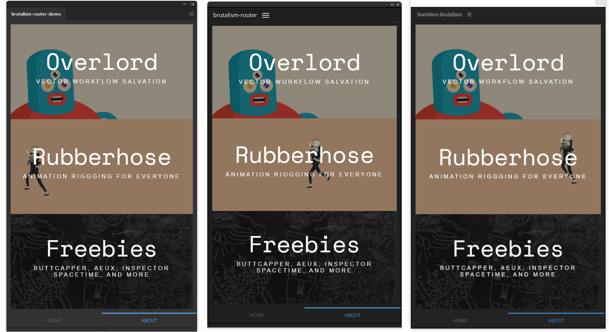

# <a href="https://www.battleaxe.co/"></a> bombino-brutalism-router

| [Installation](#installation) | [Getting Started](#getting-started) | [Features](#features) | [Commands](#commands) | [Contexts](#contexts) | [Use in Browser](#use-in-browser) | [Common Errors](#common-errors) | 
| ----------------------------- | :---------------------------: | :---------------------------------: | :---------------------: | :-------------------: | :-------------------: | :-------------------: |



> Left to right: Illustrator, Browser, After Effects

## [See the live web demo of this panel here](https://brutalism.netlify.app/#/router)

## Installation

> **NOTE:** This repo should not be `git clone`d directly because it has breaking placeholder values and will not run on it's own.

```bash
# Node and bombino are required
npm install -g bombino

# In any valid CEP extension folder:
# (e.g. <USERNAME>/AppData/Roaming/CEP/extensions)
bombino
```

## Getting started

```bash
# In any valid CEP extension folder:
bombino

# > Create a new Adobe panel
# Input the name of panel
# > Bombino (if local templates are present)
# > Vue-CLI
# > bombino-brutalism-router
# Input a valid localhost port
# > Select Y to use npm install

cd [name of panel]
npm run serve

# (Re)launch your host app and find in Windows > Extensions > [name of panel]
```

## Features:

- [Vue](https://vuejs.org/) as JS framework
- Hot Reloading (panel updates instantly on every save during `npm run serve`)
- [Vue-CLI-3](https://cli.vuejs.org/) as Node.js tooling (webkit)
- [bombino](https://github.com/Inventsable/bombino) as dev tooling and workflow
- Paginations via [Vue Router](https://router.vuejs.org/)
- Full typescript support for any app with pravdomil's Adobe types (same as writing .jsx scripts but access to host DOM as autocomplete while typing)
- Battleaxe's own [brutalism component library](https://github.com/battleaxedotco/brutalism) and design
- Various utility functions and components for ease of panel development
- ✨ [All color themes of any host app automatically handled by starlette library](https://github.com/Inventsable/starlette) ✨

---

## Commands

This panel comes with various commands baked in ([see details here](https://github.com/Inventsable/bombino-commands#commands)):

- `npm run help` - A full list of the commands available and descriptions.
- `npm run serve` - Start the development server and edit your panel.
- `npm run build` - Create and compile to production context.
- `npm run switch` - Reports whether in developer or production context and can switch automatically.
- `npm run update` - Reports current version of panel in manifest and prompts to update Major, Minor, or Micro.
- `npm run register` - Reports the current user data (if any) and prompts to save new info to be used in certificates.
- `npm run sign` - Automatically stages and signs the extension, placing it in a `./archive` directory within the current directory.

---

## Contexts

You can automate this by using `npm run switch`. In case you need to do it manually:

### For development

- Ensure `index-dev.html` is uncommented in `CSXS/manifest.xml`

```xml
  <Resources>
    <MainPath>./public/index-dev.html</MainPath>
    <!-- <MainPath>./dist/index.html</MainPath> -->
```

- Run `npm run serve` in the terminal at the project root
- Launch host application and find in Window > Extensions

> Panel now updates in real time and recompiles every time you save in VSCode

### For production

- Ensure `dist/index.html` is uncommented in `CSXS/manifest.xml`

```xml
  <Resources>
    <!-- <MainPath>./public/index-dev.html</MainPath> -->
    <MainPath>./dist/index.html</MainPath>
```

- Run `npm run build` in the terminal at the project root
- Launch host application and find in Window > Extensions

> Panel is now ready to sign and certify or be used on any client

---

## Use in Browser

1) Ensure these lines in `./vue.config.js` are commented out:

```js
configureWebpack: {
  // target: "node-webkit",
  // node: false
},
```

2) Restart your localhost server with `npm run serve`

3) Launch `https://localhost:8080` in a Chrome window

> NOTE: The panel cannot interact with the host app while in browser. Script loading and style is given a fallback (second parameter for returned data in evalScript, uses default or defined app/theme/gradient props for Panel component to determine style) while in browser.

---

## Common errors:

### I don't want my scripts in the `./src/` directory

- You can easily define script and utility script location to be anywhere in your directory [via Panel script-path and utils props](https://github.com/battleaxedotco/brutalism/tree/master/components/Panel)

### I want to make my ZXP/build size smaller

- You can use the `./.certignore` file (especially with `src` included) to manually ignore any specific files or folders during staging

### I'm getting a "require is not defined" error

- If in Adobe context and not browser, make sure your `target` and `node` lines in `./vue.config.js` are not commented out.

### Panel style isn't working (especially for Animate)

- Ensure that `starlette` is version `1.0.2` or greater.
- Due to Issues [#265](https://github.com/Adobe-CEP/CEP-Resources/issues/265) and [#266](https://github.com/Adobe-CEP/CEP-Resources/issues/266) for Animate, `<Menus>` is automatically given a `Switch Theme` option for Animate only. The user will need to manually trigger `Switch Theme` if the host theme is set to `dark` or `light`, but all future instances of the panel launch will remain in this theme.

### Panel is not updating

- Scripting files are not a part of hot-reloading and are loaded into memory at your extension's `mounted` lifecycle. You will need to `Refresh panel` in a menu for them to be updated.
- Adding or reorganizing components may cause hot reloading to fail. Many times you will be warned of this in `CEF debug`'s console, fix this by hitting `^C` in your active terminal to `Terminate batch job`, then run `npm run serve` once more and refresh the panel.

### Page Not Found (cannot find page at `localhost:####` displays in panel)

- Must run `npm run serve` and have the `App running at: -Local / -Network` message in your terminal
- If you launched the app before running `npm run serve`, click the localhost URL inside the panel's error message

### Panel is white or blank

- Check your CEF client via `localhost:####` for an error thrown in your code which breaks the panel's rendering
- If in `Production` context and receiving `404` errors in your `index.html`, ensure your `dist/index.html`'s script tags have `src` attributes such as `src=./filepath` or `src=filepath` instead of `src=/filepath` (leading slash is default but will break, should be fixed via `vue.config.js`)

### Sign/Certify is failing

- Including hidden files and repositories in your ZXP/ZIP will cause a misleading error message. Be sure to delete hidden items such as `node_modules/`, `.git/`, and any other hidden files/folders prior to your sign/certify if not including these in your `./.certignore` file.